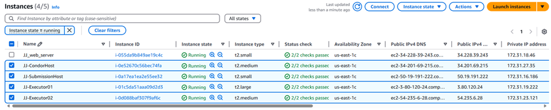
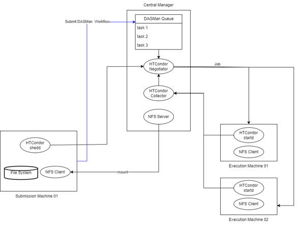
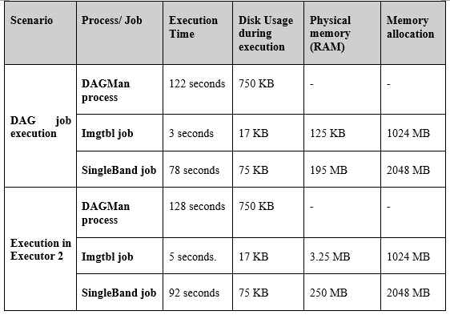

# HTCondor DAG Workflow For Image Processing
This project demonstrates how distributed resource management, shared storage, and workflow setup in AWS using HTCondor, HTCondor DAGMan, and NFS can efficiently handle data-intensive scientific workloads. 

The use case of the project is astronomical image mosaicking using the Montage , which is a widely used astronomy toolkit for assembling FITS images into science-grade mosaics images. This project focus on processing the raw FITS images to generate a single-band K-band mosaic using distributed execution.

- Dataset: 2MASS K-band
- Target Object: NGC 3372
- Field of View: 1.0 × 1.0 degrees
- Number of Images: 212

🎯**The main objectives of this project were to:**
- Design a distributed computational workflow in AWS for Astronomy Image processing 
- Understand how job dependencies affect workflow execution
- Identify and debug job submission and execution failures
- Compare the performance between distributed execution and single-node execution

## 🏗️ System Architecture & Platform Setup 
The platform is fully deployed within the AWS cloud environment and consists of 4 AWS EC2 instances were lauched (1 Central Manager, 1 Submission Node, 2 Execution Nodes):
- HTCondor Central Manager : manages job queues, matchmaking, and scheduling
- Submission Node : used by users to submit jobs and workflows
- Execution Nodes : perform the actual computations
- NFS Server : provides centralized shared storage
- HTCondor DAGMan : manages workflow dependencies and execution order

  

 

**Workflow execution flow:**
1.	The user submits the Montage DAG file from submission node to a Central Manager.
2.	DAGMan, running on the Central Manager, reads the DAG and starts scheduling the individual tasks (jobs). 
3.	The Central Manager is responsible for matching submitted jobs with available resources (Execute Nodes). This involves the Negotiator and Collector components within the Central Manager, which work together to match jobs to Execute Nodes that meet the job's requirements.
4.	Execution Nodes access the necessary input data from the NFS server, perform the computations, and write the results back to the NFS server.
5.	DAGMan monitors the progress of the workflow and ensures that all tasks are completed in the correct order.

  

##  ⚙️Workflow Design
The workflow consists of two sequential jobs executed using HTCondor DAGMan:

1. Imgtbl – Generates metadata tables from the raw astronomical images
2. SingleBand – Processes the K-band data and produces the final mosaic image

The workflow is defined as a Directed Acyclic Graph (DAG), where the SingleBand job depends on the successful completion of the Imgtbl job. This dependency ensures that metadata generation is completed before mosaic processing begins.

### 1. DAGMan Workflow Submission

    The workflow was submitted using HTCondor DAGMan, which is responsible 
    for managing job dependencies and execution order. DAGMan interprets 
    the DAG file, submits individual jobs to HTCondor, and monitors their 
    execution status.

    During submission, DAGMan automatically generated its own log and status 
    files to track workflow progress and completion. Once submitted, the 
    workflow execution could be monitored using standard HTCondor commands 
    such as condor_q and condor_history.

### 2. Job-Level Validation Strategy

    To ensure correct workflow execution, each job was first validated 
    independently before being integrated into the DAG. 

    - Job submission files (.sub) were correctly configured
    - Executables and scripts were functional
    - Input and output paths were accessible via the shared NFS directory

    By validating the jobs individually, potential issues related to job 
    configuration were isolated from workflow orchestration concerns.

### 3. Debugging and Root Cause Analysis

    Debugging was conducted using standard HTCondor and HPC troubleshooting 
    practices, including:

    - Inspecting the job queue to identify job states
    - Reviewing job-specific log, output, and error files
    - Verifying execution permissions for shell scripts
    - Ensuring absolute paths were used for executables, logs, and 
       output files
    - Manually executing scripts outside HTCondor to confirm correctness
    - Confirming that execution nodes had access to required files via NFS

### 4. Execution Environment 

    HTCondor jobs execute on remote execution nodes, not on the
    submission node.

    - Scripts must not rely on submission-node-specific paths or environments
    - All required data and executables must be accessible from execution nodes
    - Shared storage (NFS) is essential to ensure consistent file access

    Misalignment between submission and execution environments was identified 
    as a key factor that can lead to job execution failures if not properly managed.

## 📊 Output & Findings
- K-band FITS Mosaic Ouput : Visualized using mViewer
  
 

- Performance comparison : Distributed execution consistently outperformed single-node execution in both speed and scalability.

    | Distributed Execution (Multiple Executors)   | Single Executor (t2.medium)|
    | -------- | ------- |
    | Faster execution  | Increased execution time    |
    | Better resource utilization | Higher memory usage    |
    | Reduced contention    | Single point of failure    |
     

## ✅ Conclusion
This project validates the effectiveness of HTCondor + DAGMan + NFS as a distributed computing solution for Montage Astronomy Image Processing. 

- Improved performance through distributed execution
- Efficient shared data access
- Future improvements include expanding storage capacity for different band images, scaling executor nodes, and processing multi-band datasets.

**Skills Demonstrated**
1. HTCondor & DAGMan setup
2. Distributed job scheduling
3. Workflow dependency management
4. Linux command-line operations
5. Debugging and root cause analysis
